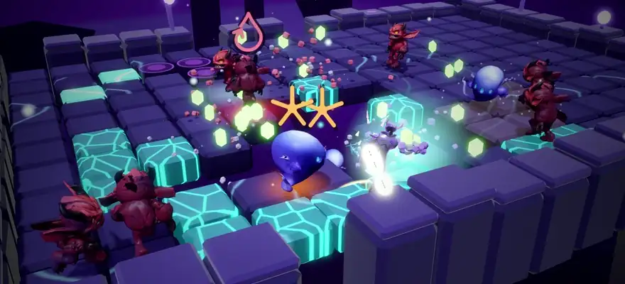
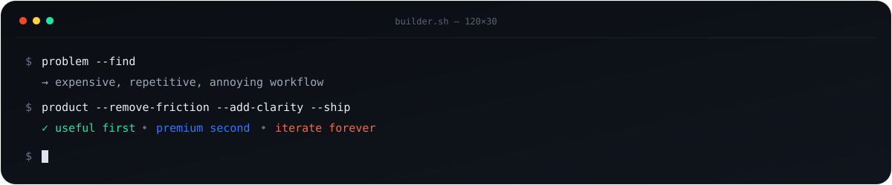

<!--
  Premium GitHub profile README for Nick.
  Drop this README.md + /assets into the special repo whose name matches your GitHub username.
-->

<div align="center">
  
</div>

<br/>

<div align="center">
  <a href="https://nicksquared.co"></a>
  <a href="https://spot.coach"></a>
</div>

<br/>

## Building now

<table>
<tr>
<td width="33%" valign="top">

### 🎮 Riftstep
**Every step is a weapon.**

A mobile action roguelite built in Godot. No attack button: the tiles you leave behind rip out and smash into enemies.

</td>
<td width="33%" valign="top">

### 🌱 Aliveish
**Don't let it die.**

A tiny creature to check on once a day, ten friends and four small games keeping Sprout company.

</td>
<td width="33%" valign="top">

### 🏋️ Spot
**Fitness coaching with a pulse.**

A coach + client platform built around workouts, progress, video, character progression and a more engaging training experience.

</td>
</tr>
<tr>
<td width="33%" valign="top">

<a href="https://apps.apple.com/us/app/riftstep-step-to-survive/id6813199036"></a> <a href="https://play.google.com/store/apps/details?id=co.nicksquared.riftstep"></a>

</td>
<td width="33%" valign="top">

<a href="https://play.google.com/store/apps/details?id=co.nicksquared.aliveish"></a> 

</td>
<td width="33%" valign="top">

[**spot.coach →**](https://spot.coach)

</td>
</tr>
</table>

<div align="center">
  
</div>

## The stack I reach for

<div align="center">
  
</div>

<div align="center">
  
</div>

<br/>

```text
PRODUCT        ENGINEERING        AI / AUTOMATION        3D / INTERACTIVE
─────────────────────────────────────────────────────────────────────────
SaaS           TypeScript         Agents + tools          Godot
Mobile         React / Next.js    LLM workflows           Blender
UX systems     C# / .NET          Computer vision         3D pipelines
B2B workflows  Dataverse / Azure  Automation              Motion / video
```

## How I like to build

> **Find an expensive or annoying workflow → strip away the friction → make the interface feel inevitable.**

I care about products that are useful before they are impressive — then I push the details until they feel premium. My work tends to sit where **software, automation, AI and strong product UX** overlap.

<div align="center">
  
</div>

### Current mode

`BUILD` → `TEST` → `SHIP` → `WATCH REAL USERS` → `ITERATE`

<sub>Always building. Usually overthinking the last 5%.</sub>
