<!--
  Premium GitHub profile README for Nick.
  Drop this README.md + /assets into the special repo whose name matches your GitHub username.
-->

<div align="center">
  
</div>

<br/>

<div align="center">
  <a href="https://nicksquared.co"></a>
  <a href="https://getloadsignal.com"></a>
  <a href="https://spot.coach"></a>
</div>

<br/>

## Building now

<table>
<tr>
<td width="33%" valign="top">

### 🚚 LoadSignal
**Freight visibility without the friction.**

Tracking, ETA intelligence, exception workflows and automation for freight brokers — with driver-friendly SMS/location flows.

[**getloadsignal.com →**](https://getloadsignal.com)

</td>
<td width="33%" valign="top">

### 🏋️ Spot
**Fitness coaching with a pulse.**

A coach + client platform built around workouts, progress, video, character progression and a more engaging training experience.

[**spot.coach →**](https://spot.coach)

</td>
<td width="33%" valign="top">

### 🥬 Provision
**Planning + inventory for real kitchens.**

A premium provisioning system for pantry inventory, expiry, meal planning, shopping and intelligent restocking.

**Currently in the lab.**

</td>
</tr>
</table>

<div align="center">
  
</div>

## The stack I reach for

<div align="center">
  
</div>

<br/>

```text
PRODUCT        ENGINEERING        AI / AUTOMATION        3D / INTERACTIVE
─────────────────────────────────────────────────────────────────────────
SaaS           TypeScript         Agents + tools          Godot
Mobile         React / Next.js    LLM workflows           Blender
UX systems     C# / .NET          Computer vision         3D pipelines
B2B workflows  Dataverse / Azure  Automation              Motion / video
```

## How I like to build

> **Find an expensive or annoying workflow → strip away the friction → make the interface feel inevitable.**

I care about products that are useful before they are impressive — then I push the details until they feel premium. My work tends to sit where **software, automation, AI and strong product UX** overlap.

<div align="center">
  
</div>

### Current mode

`BUILD` → `TEST` → `SHIP` → `WATCH REAL USERS` → `ITERATE`

<sub>Always building. Usually overthinking the last 5%.</sub>
